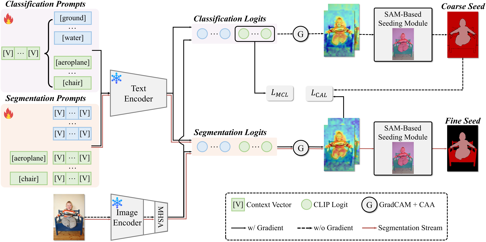

# Foundation Model Assisted Weakly Supervised Semantic Segmentation (WACV 2024)

This repo is a implementation of the [Foundation Model Assisted Weakly Supervised Semantic Segmentation](https://arxiv.org/abs/2312.03585). The code is developed based on the Pytorch framework.

[](https://paperswithcode.com/sota/weakly-supervised-semantic-segmentation-on?p=foundation-model-assisted-weakly-supervised) \
[](https://paperswithcode.com/sota/weakly-supervised-semantic-segmentation-on-1?p=foundation-model-assisted-weakly-supervised) \
[](https://paperswithcode.com/sota/weakly-supervised-semantic-segmentation-on-4?p=foundation-model-assisted-weakly-supervised)

## Introduction



This work aims to leverage pre-trained foundation models, such as contrastive language-image pre-training (CLIP) and segment anything model (SAM), to address weakly supervised semantic segmentation (WSSS) using image-level labels. To this end, we propose a coarse-to-fine framework based on CLIP and SAM for generating high-quality segmentation seeds. Specifically, we construct an image classification task and a seed segmentation task, which are jointly performed by CLIP with frozen weights and two sets of learnable task-specific prompts. A SAM-based seeding (SAMS) module is designed and applied to each task to produce either coarse or fine seed maps. Moreover, we design a multi-label contrastive loss supervised by image-level labels and a CAM activation loss supervised by the generated coarse seed map. These losses are used to learn the prompts, which are the only parts need to be learned in our framework. Once the prompts are learned, we input each image along with the learned segmentation-specific prompts into CLIP and the SAMS module to produce high-quality segmentation seeds. These seeds serve as pseudo labels to train an off-the-shelf segmentation network like other two-stage WSSS methods. Experiments show that our method achieves the state-of-the-art performance on PASCAL VOC 2012 and competitive results on MS COCO 2014.

## Requirements

We use [conda-pack](https://conda.github.io/conda-pack/) to share our environment `tw-mm.tar.gz`, which can be downloaded at [HERE](https://pan.baidu.com/s/1jLHxyW5Hwv9YBmusazGGxg?pwd=2333). After downloading the packed environment, run:

```bash
# Unpack environment into conda env directory.
tar -xzf tw-mm.tar.gz -C YOUR_CONDA_ENV_DIR

# Activate the environment.
conda activate tw-mm

# Install the project-specific segment-anything and mmsegmentation.
cd PROJECT_ROOT/others
pip install -e ./segment-anything
pip install -e ./mmsegmentation
```

If `conda-pack` is not available, we also provide the environment spec file `tw-mm.yaml` at [HERE](https://pan.baidu.com/s/1jLHxyW5Hwv9YBmusazGGxg?pwd=2333). The package `alchemy_cat` can be download here [HERE](https://github.com/HAL-42/AlchemyCat).

## Preparing Project

### Code

Run `git clone https://github.com/HAL-42/FMA-WSSS.git --recurse-submodules` to clone this repo and all its submodules.

### Datasets

Download and unzip `datasets.tar` from [HERE](https://pan.baidu.com/s/1jLHxyW5Hwv9YBmusazGGxg?pwd=2333), place it in the root directory, and name it `datasets`.

The directory structure of `datasets` should be:

```shell
datasets
├── coco2014
│   ├── annotations
│   │   ├── train2014 -> train2014_ur
│   │   ├── train2014_ur
│   │   ├── train2014_wt
│   │   ├── val2014 -> val2014_ur
│   │   ├── val2014_ur
│   │   └── val2014_wt
│   ├── color_annotations
│   │   ├── train2014_ur
│   │   └── train2014_wt
│   ├── images
│   │   ├── train2014
│   │   └── val2014
│   ├── imagesLists
│   └── third_party
│       ├── ur_wt_consistency
│       └── wt_ur_consistency
└── VOC2012
    ├── Annotations
    ├── DummyTest
    ├── ImageSets
    │   ├── Action
    │   ├── Layout
    │   ├── Main
    │   ├── Segmentation
    │   └── SegmentationAug
    ├── JPEGImages
    ├── SegmentationClass
    ├── SegmentationClassAug
    ├── SegmentationObject
    └── third_party
        └── ColorSegmentationClassAugColor
```

### Pretrains

Download and unzip `pretrains.tar` from [HERE](https://pan.baidu.com/s/1jLHxyW5Hwv9YBmusazGGxg?pwd=2333), place it in the root directory, and name it `pretrains`.

The directory structure of `pretrains` should be:

```
pretrains
├── CLIP
├── rand_ref  # Randomly pre-initialized learnable prompt contexts, loaded before training for controlling randomness.
│   └── coop_ctx
│       ├── hash_seed
│       │   └── std=·125
│       └── M=16
└── SAM
```

## Usage
### PASCAL VOC2012
```bash
cd PROJECT_ROOT

# Generate SAM-based quasi-superpixel.
# Decrease -b or -w if CUDA OOM.
python src/tasks/sam_auto_seg/par_run.py --purge 1 -b 256 -w 50 -m uncompressed_rle -c configs/VOC/sams/cfg.py

# Train classification task.
python src/tasks/train_coop/run.py -i 0 -e 0 -c configs/VOC/seg/cfg.py

# Refine classification CAM with CAA.
python src/tasks/aff_cam/run.py -P 0 -e 0 --cache_ori_cam 0 -c configs/VOC/cls/infer/final/affx2,at_score,att2affx1/cfg.py

# Generate coarse seed with SAM-Based Seeding Modul.
python src/tasks/anns_seed/run.py -c configs/VOC/cls/infer/final/affx2,at_score,att2affx1/ann,affed/cfg.py

# Train segmentation task.
python src/tasks/train_coop/run.py -i 0 -e 0 -c configs/VOC/seg/cfg.py

# Refine segmentation CAM with CAA.
python src/tasks/aff_cam/run.py -P 0 -e 0 --cache_ori_cam 0 -c configs/VOC/seg/infer/final/affx2,at_cam,attx1,·5thresh/cfg.py

# Generate fine seed with SAM-Based Seeding Modul.
python src/tasks/anns_seed/run.py -c configs/VOC/seg/infer/final/affx2,at_cam,attx1,·5thresh/ann,affed/cfg.py

# Use mmsegmentaion for stage II.
cd others/mmsegmentation
ln -s ../../datasets data
ln -s ../../experiment exp_root
ln -s ../../experiment/others/mmseg work_dirs

# Train segmentation network with fine seed.
bash tools/dist_train.sh configs/m2f_psudo/m2f-sl22-bt4-80k-512x-VOC.py 2

# Evaluate segmentaion network (at the best checkpoint).
python tools/test.py \
    configs/m2f_psudo/m2f-sl22-bt4-80k-512x-VOC.py \
    work_dirs/m2f-sl22-bt4-80k-512x-VOC/iter_30000.pth \
    --work-dir work_dirs/m2f-sl22-bt4-80k-512x-VOC/infer/best,ss \
    --show-dir work_dirs/m2f-sl22-bt4-80k-512x-VOC/infer/best,ss/viz
```

### MS COCO2014
```bash
cd PROJECT_ROOT

# Generate SAM-based quasi-superpixel.
# Decrease -b or -w if CUDA OOM.
python src/tasks/sam_auto_seg/par_run.py --purge 1 -b 256 -w 50 -m uncompressed_rle -c configs/COCO/sams/cfg.py

# Train classification task.
python src/tasks/train_coop/run.py -i 0 -e 0 -c configs/COCO/cls/cfg.py

# Infer CAM of segmentation task at the best iteration.
python src/tasks/infer_cam/run.py -e 0 -P 0 --no_cache 1 -c configs/COCO/cls/infer/6150/cfg.py

# Refine classification CAM with CAA.
python src/tasks/aff_cam/run.py -P 0 -e 0 --cache_ori_cam 0 -c configs/COCO/cls/infer/6150/aff/cfg.py

# Generate coarse seed with SAM-Based Seeding Modul.
python src/tasks/anns_seed/run.py -c configs/COCO/cls/infer/6150/aff/ann/cfg.py

# Train segmentation task.
python src/tasks/train_coop/run.py -i 0 -e 0 -c configs/COCO/seg/cfg.py

# Infer CAM of segmentation task at the best iteration.
python src/tasks/infer_cam/run.py -e 0 -P 0 --no_cache 1 -c configs/COCO/seg/infer/45k/cfg.py

# Generate fine seed with SAM-Based Seeding Modul.
python src/tasks/anns_seed/run.py -c configs/COCO/seg/infer/45k/ann/cfg.py

# Use mmsegmentaion for stage II.
cd others/mmsegmentation
ln -s ../../datasets data
ln -s ../../experiment exp_root
ln -s ../../experiment/others/mmseg work_dirs

# Train segmentation network with fine seed.
bash tools/dist_train.sh configs/m2f_psudo/m2f-sl22-bt4-100k-512x-COCO.py 2

# Evaluate segmentaion network (at the best checkpoint).
python tools/test.py \
    configs/m2f_psudo/m2f-sl22-bt4-100k-512x-COCO.py \
    work_dirs/m2f-sl22-bt4-100k-512x-COCO/iter_90000.pth \
    --work-dir work_dirs/m2f-sl22-bt4-100k-512x-COCO/infer/best,ss \
    --show-dir work_dirs/m2f-sl22-bt4-100k-512x-COCO/infer/best,ss/viz
```


## Results

Download and unzip our experimental results `experiment.tar` from [HERE](https://pan.baidu.com/s/1jLHxyW5Hwv9YBmusazGGxg?pwd=2333), **which includes our log, seeds, model weights and inference results.** It is recommended to place it in the root directory, and name it `experiment`.

The directory structure of `experiment` should be:
<details> <summary><font color="#539BF5">[CLICK TO EXPAND]</font></summary>
<pre><code>
# Important seeds, model weights, and inference results are marked by # comments.
.
├── COCO
│   ├── cls
│   │   ├── checkpoints  # model weights of COCO classification task.
│   │   ├── infer
│   │   │   └── 6150
│   │   │       ├── aff
│   │   │       │   ├── ann
│   │   │       │   │   ├── eval
│   │   │       │   │   ├── seed  # COCO's coarse seeds
│   │   │       │   │   ├── stdout
│   │   │       │   │   └── viz
│   │   │       │   │       ├── color_seed
│   │   │       │   │       └── img_cam_seed
│   │   │       │   ├── cam_affed
│   │   │       │   ├── eval
│   │   │       │   ├── stdout
│   │   │       │   └── viz
│   │   │       │       ├── cam_affed
│   │   │       │       └── score
│   │   │       ├── cam
│   │   │       ├── eval
│   │   │       ├── stdout
│   │   │       └── viz
│   │   │           ├── cam
│   │   │           └── score
│   │   ├── stdout
│   │   ├── summary
│   │   └── val
│   │       ├── iter-12300
│   │       │   ├── eval
│   │       │   └── stdout
│   │       ├── iter-18450
│   │       │   ├── eval
│   │       │   └── stdout
│   │       └── iter-6150
│   │           ├── eval
│   │           └── stdout
│   ├── sams  # COCO's SAM-based quasi-superpixel.
│   │   ├── train
│   │   │   ├── anns
│   │   │   ├── stdout
│   │   │   └── viz
│   │   │       └── masks
│   │   │           ├── level=0,1
│   │   │           ├── level=0,1,2
│   │   │           └── level=2
│   │   └── val
│   │       ├── anns
│   │       ├── stdout
│   │       └── viz
│   │           └── masks
│   │               ├── level=0,1
│   │               ├── level=0,1,2
│   │               └── level=2
│   └── seg
│       ├── checkpoints  # model weights of the COCO segmentation task.
│       ├── infer
│       │   └── 45k
│       │       ├── ann
│       │       │   ├── eval
│       │       │   ├── seed  # COCO's fine seeds.
│       │       │   └── stdout
│       │       ├── cam
│       │       ├── eval
│       │       ├── stdout
│       │       └── viz
│       │           ├── cam
│       │           └── score
│       ├── stdout
│       ├── summary
│       └── val
│           ├── iter-22500
│           │   ├── eval
│           │   └── stdout
│           ├── iter-45000
│           │   ├── eval
│           │   └── stdout
│           └── iter-67500
│               ├── eval
│               └── stdout
├── others
│   └── mmseg
│       ├── m2f-sl22-bt4-100k-512x-COCO  # model weights of the COCO segmentation network.
│       │   ├── 20230627_221037
│       │   │   └── vis_data
│       │   └── infer
│       │       └── best,ss
│       │           ├── 20230628_210854
│       │           ├── masks  # Inference results of the COCO segmentation network on COCO val.
│       │           ├── masks_color
│       │           ├── seg_preds
│       │           └── viz
│       │               └── vis_data
│       │                   └── vis_image
│       └── m2f-sl22-bt4-80k-512x-VOC  # model weights of the VOC segmentation network.
│           ├── 20231208_223350
│           │   └── vis_data
│           └── infer
│               └── best,ss
│                   ├── 20231210_153511
│                   ├── masks  # Inference results of the COCO segmentation network on VOC val.
│                   ├── masks_color
│                   └── seg_preds
└── VOC
    ├── cls
    │   ├── checkpoints  # model weights of VOC classification task.
    │   ├── infer
    │   │   └── final
    │   │       ├── affx2,at_score,att2affx1
    │   │       │   ├── ann,affed
    │   │       │   │   ├── eval
    │   │       │   │   ├── seed  # VOC's coarse seeds
    │   │       │   │   ├── stdout
    │   │       │   │   └── viz
    │   │       │   │       ├── color_seed
    │   │       │   │       └── img_cam_seed
    │   │       │   ├── cam_affed
    │   │       │   ├── eval
    │   │       │   ├── stdout
    │   │       │   └── viz
    │   │       │       ├── cam_affed
    │   │       │       └── score
    │   │       ├── cam
    │   │       ├── eval
    │   │       ├── stdout
    │   │       └── viz
    │   │           ├── cam
    │   │           └── score
    │   ├── stdout
    │   └── summary
    ├── sams  # VOC's SAM-based quasi-superpixel.
    │   ├── split=test
    │   │   ├── anns
    │   │   ├── stdout
    │   │   └── viz
    │   │       └── masks
    │   │           ├── level=0,1
    │   │           ├── level=0,1,2
    │   │           └── level=2
    │   ├── split=train_aug
    │   │   ├── anns
    │   │   ├── stdout
    │   │   └── viz
    │   │       └── masks
    │   │           ├── level=0,1
    │   │           ├── level=0,1,2
    │   │           └── level=2
    │   ├── split=val
    │   │   ├── anns
    │   │   ├── stdout
    │   │   └── viz
    │   │       └── masks
    │   │           ├── level=0,1
    │   │           ├── level=0,1,2
    │   │           └── level=2
    │   └── stdout
    └── seg
        ├── checkpoints  # model weights of the VOC segmentation task.
        ├── infer
        │   └── final
        │       ├── affx2,at_cam,attx1,·5thresh
        │       │   ├── ann,affed
        │       │   │   ├── eval
        │       │   │   ├── seed  # VOC's fine seeds.
        │       │   │   ├── stdout
        │       │   │   └── viz
        │       │   │       ├── color_seed
        │       │   │       └── img_cam_seed
        │       │   ├── cam_affed
        │       │   ├── eval
        │       │   ├── stdout
        │       │   └── viz
        │       │       ├── cam_affed
        │       │       └── score
        │       ├── cam
        │       ├── eval
        │       ├── stdout
        │       └── viz
        │           ├── cam
        │           └── score
        ├── stdout
        ├── summary
        └── val
            ├── iter-10200
            │   ├── eval
            │   └── stdout
            ├── iter-15300
            │   ├── eval
            │   └── stdout
            └── iter-5100
                ├── eval
                └── stdout
</code></pre>
</details>

### Seed Generation
| Datasets | mIoU (%) |
| --- | --- |
| PASCAL VOC2012 *trainaug* | 73.9 |
| MS COCO2014 *train* | 47.5 |
### Segmentation
| Datasets              | Network | Pretrained | mIoU (%)                                                                      |
|-----------------------| --- | --- |-------------------------------------------------------------------------------|
| PASCAL VOC2012 *val*  | Swin-L | ImageNet-21k | 83.1                                                                          |
| PASCAL VOC2012 *test* | Swin-L | ImageNet-21k | 81.6 <sup>[[3]](http://host.robots.ox.ac.uk:8080/anonymous/PKEHGZ.html)</sup> |
| MS COCO 2014 *val*    | Swin-L | ImageNet-21k | 55.4                                                                          |

*Please note that：* \
*1.Our reproduction results on PASCAL VOC 2012 are slightly different to the paper (<font color=Red>0.3↓</font> in seed mIoU and an <font color=Green>0.5↑</font> in segmentation results).* \
*2.Even if reproduced exactly according to our README, the results may still vary due to GPU type, CUDA and PyTorch versions, as well as inherent randomness of PyTorch.* \
*3.The result link on PASCAL VOC evaluation server.*

## Acknowledgement

We borrowed the code from [CLIP-ES](https://github.com/linyq2117/CLIP-ES), [CoOp](https://github.com/KaiyangZhou/CoOp), [mmsegmentation](https://github.com/open-mmlab/mmsegmentation) and [Segment-Anything](https://github.com/facebookresearch/segment-anything.git). Thanks for their wonderful works.

Pay the highest attribute to [AlchemyCat](https://github.com/HAL-42/AlchemyCat), a powerful and user-friendly deep learning toolkit.

## License

This repo is released under the  Apache License.

## Citation
If you find this project helpful for your research, please consider citing the following BibTeX entry.
```latex
@misc{yang2023foundation,
      title={Foundation Model Assisted Weakly Supervised Semantic Segmentation}, 
      author={Xiaobo Yang and Xiaojin Gong},
      year={2023},
      eprint={2312.03585},
      archivePrefix={arXiv},
      primaryClass={cs.CV}
}
```